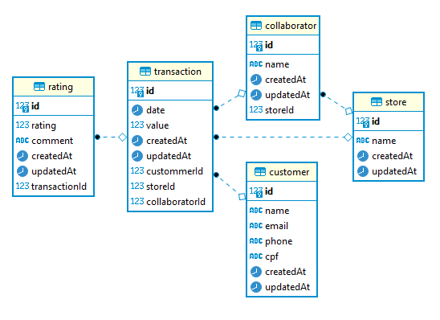

# Experiences

Experiences is a commenting API to evaluate the customer experience developed with NestJs in monorepo mode

## Technologies:

- Node
- Typescript
- NestJs
- Jest
- TypeOrm
- Postgres
- Swagger
- Docker

## Functionalities:

- Customers:
  Complete crud of customers
- Stores:
  Complete crud of stores
- Collaborators:
  Complete crud of collaborators related with stores
- Transaction:
  Crud without delete, related with stores, collaborators and customers
- Rating:
  Crud without update and delete, related with transactions

## Database relations:

<div>
  
</div>

## System requirements:

- Docker Desktop 3.3.1 +

## Installation:

With the desktop docker installed follow the commands below in your preferred terminal:

```bash
# Clone project
git clone git@github.com:julioantonini/experiences.git
# Enter in project folder
cd experiences
# run docker compose build
docker-compose up --build -d
```

Access the project in your web brouwser from address:
http://localhost:3000

### Or access the Live demo:

https://experiences-api.herokuapp.com/

#### Project date:

April 2021
